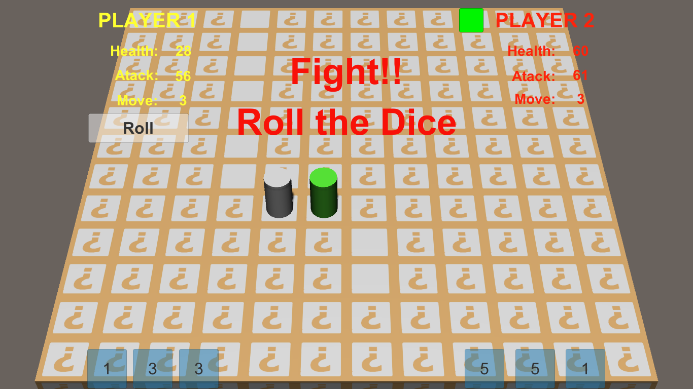

# Board Game

## File Structure

In this project you'll find the following directories and files:

```
BoardGame\
├── Assets
│   ├── Audio
│   ├── Materials
│   │   ├── EmptyQuadTile.mat
│   │   ├── Normal.mat
│   │   ├── QuadTile.mat
│   │   └── Select.mat
│   ├── Prefabs
│   │   ├── CharacterePrefab.prefab
│   │   ├── DicePrefab.prefab
│   │   └── TilePrefab.prefab
│   ├── Scenes
│   │   ├── BoardGame.unity
│   │   ├── FinalMenu.unity
│   │   └── MainMenu.unity
│   ├── Scripts
│   │   ├── Controllers
│   │   │   ├── BoardRender.cs
│   │   │   ├── FinalMenu.cs
│   │   │   ├── IRollEvent.cs
│   │   │   ├── NavegationMenu.cs
│   │   │   ├── PickTile.cs
│   │   │   ├── PlayerRender.cs
│   │   │   ├── Roller.cs
│   │   │   └── TileComponent.cs
│   │   ├── Models
│   │   │   ├── BoardGrid.cs
│   │   │   ├── Collectable.cs
│   │   │   ├── Dice.cs
│   │   │   ├── KeyWordPersistence.cs
│   │   │   └── Player.cs
│   │   ├── Utils
│   │   │   └── MathUtil.cs
│   │   └── Game.cs
│   └── Textures
│   		├── EmptyQuadTile.psd
│   		└── QuadTile.psd
├── ProjectSettings
├── .gitignore
├── LICENCE.md
└── README.md
```

## Demo
### Initial Menu


### Main Scene: two players initialized with 3 moves and 5 health points


### To move click on the tiles next to the character, will only allow valid moves


### A player's turn is indicated by the character's color (green)


### In the fight the roll button is enabled, to roll the 3 dice, begins the player who is on the turn


### The winner of the fight is defined by the result of the dice


### Each tile gives a gain (moves, attack, health) to the player who is on it, Empty tiles are left during the tour


### The tiles are full when there are less than 10% empty tiles


### The game ends when one of the players has no health points


## Resources
- Unity 2019.3.5f1

## Licensing

- Copyright 2021 Abel Ticona (https://aibel18.github.io)
- Abel Ticona [license](LICENSE.md)

## Useful Links